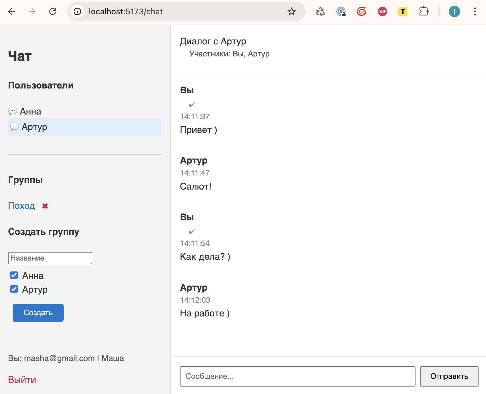

# FastAPI + Docker

## Быстрый запуск (без объяснений)

```bash
git clone https://github.com/ploshadka/chat.git
cd chat
docker compose up -d --build
docker compose run --rm backend alembic upgrade head
docker compose run --rm backend python scripts/init_data.py
```

## Запуск (с объяснениями)

В фоне:
```bash
docker compose up -d --build 
```

С консолью:
```bash
docker compose up --build 
```

- Ошибки в консоли после миграции исчезнут. 
- Ошибку фронта можно игнорировать - chrome служебный файл подкидывает.

## Миграция данных

> ⚠️ В программах для подключения к БД использовать порт 5435

Если докер запущен НЕ в фоне, то запускать в ОТДЕЛЬНОЙ вкладке терминала:

Инсталляция БД
```bash
docker compose run --rm backend alembic upgrade head
```

Инсталляция первичных данных
```bash
docker compose run --rm backend python scripts/init_data.py
```


## После запуска

Тестировать API можно здесь:
- http://localhost:8000/docs# — Swagger
- http://localhost:8000/redoc — Redoc

## Веб-чат

Протестить работу можно через веб-чат, созданный на Svelte и использующий бэкенд FastAPI:
- http://localhost:5173/

Для входа на сайт использовать следующие данные.
- пользователь: `masha@gmail.com` или: `artur@gmail.com` 
- пароль: `1234`  

Также можно зарегистрироваться вручную.

- Код для фронта писался быстро для демонстрации работы чата без акцента на чистоту кодинга. 
- Что-то может на фронте не заработать по той же причине, хотя в целом протестировал все работает.
- Кроме уведомлений о прочтении в чате, но это работает на API бэкенде - как это проверить в Postman будет описано ниже.

## Тестирование веб-сокета через Postman
Тест работы сокета можно протестировать через Postman

Подключение к 1-у чату через 1-ого пользователя:
- ws://localhost:8000/ws/chat/1/1

Отправить сообщение:
```
{
  "type": "new_message",
  "text": "Привет!",
  "client_id": "abc-123"
}
```

Для тестирования, что сообщение прочитано:
```
{
  "type": "mark_as_read",
  "message_id": 1
}
```

Чтобы протестировать, что сообщение прочитано несколькими, нужно переподключиться другим пользователем и повторить запрос

Подключение к 1-у чату через 2-ого пользователя:
- ws://localhost:8000/ws/chat/1/2

Отправить:
```
{
  "type": "mark_as_read",
  "message_id": 1
}
```

В БД в колонке read_by появится второй id {2,1} 

## Тестирование через swagger

Например:

- http://localhost:8000/docs#/default/create_group_groups_post

По команде будет создана группа:

```
{
  "title": "Рабочая группа",
  "creator_id": 1,
  "member_ids": [1, 2, 3]
}
```

Или история сообщений:
- http://localhost:8000/docs#/default/get_history_history__chat_id__get


## Запуск тестов  

Реализовано 2 теста.

⚠️ Перед запуском тестов обязательно должен быть запущен сервер, иначе будет ошибка.

После запуска теста будут созданы реальные данные в БД. Так задумано.

Тесты можно запустить отдельными командами:

```bash
pytest backend/app/tests/test_create_group.py
pytest backend/app/tests/test_create_user.py
```

Или все тесты сразу одной командой:

```bash
pytest
```

При правильном запуске (включённый сервер и запуск из корня проекта), вывод будет примерно таким:

```
backend/app/tests/test_create_group.py .                                           [ 50%]
backend/app/tests/test_create_user.py .                                            [100%]
================================== 2 passed in 0.41s ===============================
```


## Логирование

- Все типы логирования поместил в один файл, но при желании это легко разбивается на отдельные файлы по типам ошибок

## Скрины текущего чата



